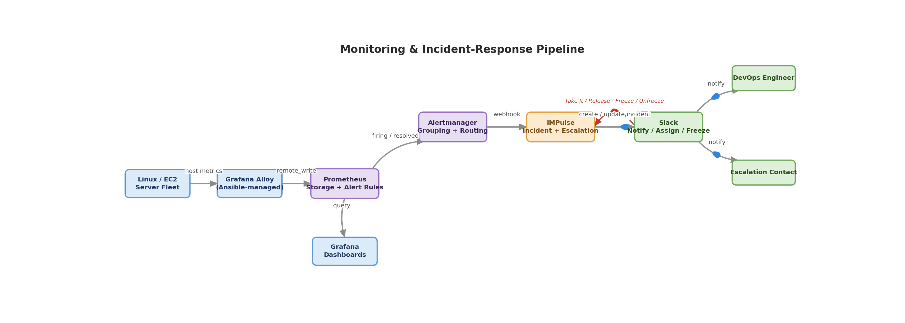
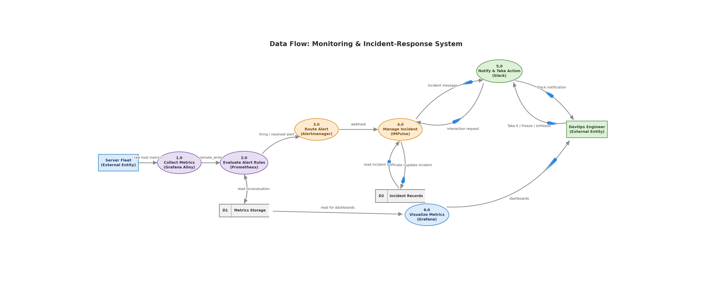
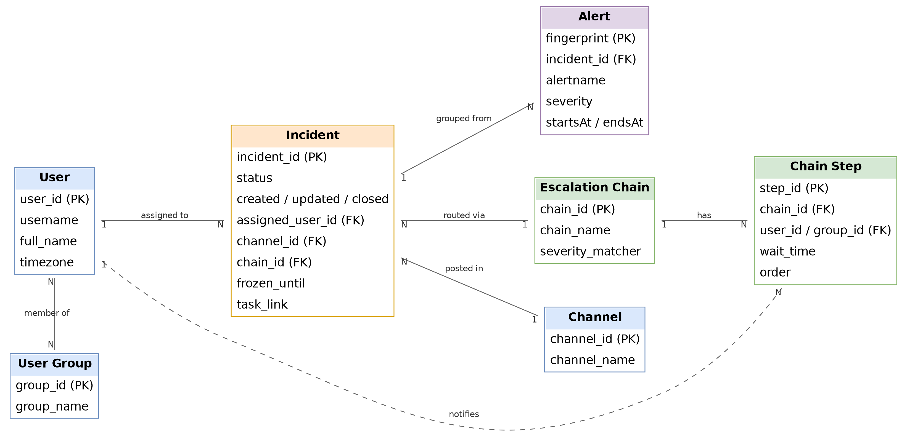
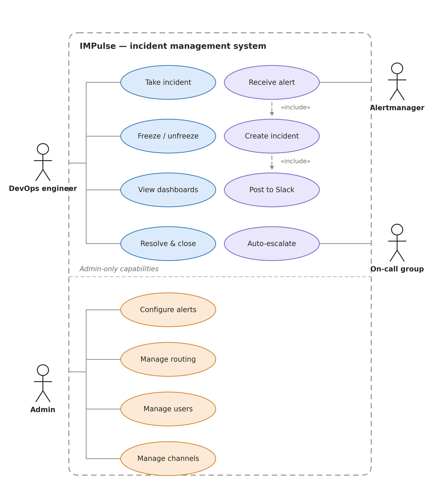
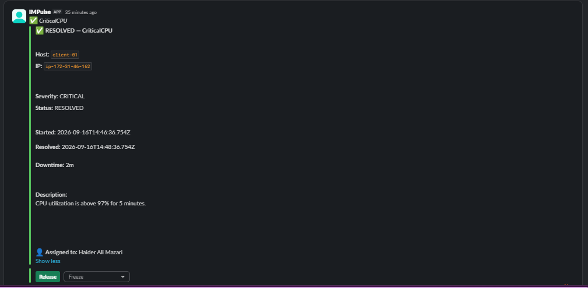
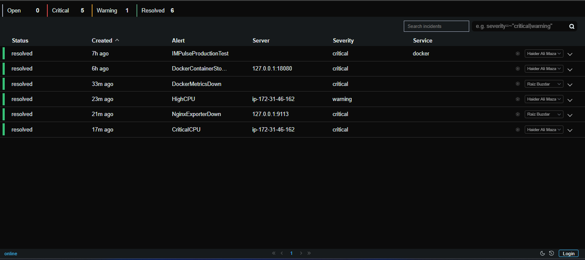

# impulse-incident-response

Monitoring and incident response platform built with Prometheus, Alertmanager, IMPulse, Slack and Grafana.

> **In one line:** this project watches a fleet of Linux servers, and the moment something goes wrong, it makes sure a real person finds out about it, takes ownership of it, and doesn't lose track of it until it's fixed.
>

---

## Table of contents

1. [What problem does this solve?](#1-what-problem-does-this-solve)
2. [The big picture — Architecture Diagram](#2-the-big-picture--architecture-diagram)
3. [How information moves — Data Flow Diagram (DFD)](#3-how-information-moves--data-flow-diagram-dfd)
4. [How the data is organized — Entity Relationship Diagram (ERD)](#4-how-the-data-is-organized--entity-relationship-diagram-erd)
5. [Who can do what — Use Case Diagram](#5-who-can-do-what--use-case-diagram)
6. [IMPulse screenshots](#6-impulse-screenshots)
7. [The building blocks](#7-the-building-blocks)
8. [Getting started — prerequisites & quick setup](#8-getting-started--prerequisites--quick-setup)
9. [From "something broke" to "someone's on it" — step by step](#9-from-something-broke-to-someones-on-it--step-by-step)
10. [What you can actually do in Slack](#10-what-you-can-actually-do-in-slack)
11. [Who gets notified, and when](#11-who-gets-notified-and-when)
12. [What's actually being monitored](#12-whats-actually-being-monitored)
13. [Rolling this out to servers automatically (Ansible)](#13-rolling-this-out-to-servers-automatically-ansible)
14. [Keeping it healthy — checks & troubleshooting](#14-keeping-it-healthy--checks--troubleshooting)
15. [A timing detail worth knowing](#15-a-timing-detail-worth-knowing)
16. [Testing that it actually works](#16-testing-that-it-actually-works)
17. [Security basics](#17-security-basics)
18. [Where this could go next](#18-where-this-could-go-next)
19. [Quick command reference](#19-quick-command-reference)

---

## 1. What problem does this solve?

Servers break. Disks fill up, containers crash, services stop responding. On their own, monitoring tools are good at noticing this — but noticing isn't the hard part.

The hard part is: *who saw it? Are they actually working on it? What happens if they miss it?*

That's the gap this project closes. It doesn't just detect problems — it turns each problem into a small, trackable task ("an incident") with an owner, a deadline-like escalation, and a clear place (Slack) where the whole team can see what's happening.

### What it actually does, in plain terms

- Watches CPU, memory, disk space, network activity and uptime on every server
- Also watches web server (NGINX) health where that applies
- Decides when something is bad enough to be an "alert"
- Turns that alert into an incident and posts it in Slack
- Lets an engineer click **Take It** to claim the incident
- If nobody claims it in time, it automatically pings the next person
- Lets an engineer **Freeze** an incident temporarily (e.g. "I know, I'm on it, stop pinging people")
- Automatically marks things resolved and closed once the underlying problem clears
- Gives the team dashboards (Grafana) to see server health at a glance

---

## 2. The big picture — Architecture Diagram

This shows every moving part and how they connect, from the servers being watched all the way to the person who gets pinged in Slack.



*Editable source: `images/architecture-diagram.drawio` — open it at [app.diagrams.net](https://app.diagrams.net) to edit.*

**How to read it, left to right:**

1. **Collection** — Grafana Alloy sits on every server and quietly ships out health metrics.
2. **Metrics & Alerting** — Prometheus stores those metrics and constantly checks them against rules ("is disk usage over 85%?"). If a rule is broken, it hands that off to Alertmanager, which is responsible for making sure the alert actually gets delivered somewhere.
3. **Incident Management** — IMPulse receives that alert and turns it from "a fact about a server" into "a task someone owns."
4. **Human Interface** — Slack is where a person actually sees the problem and acts on it (Take It, Freeze, Unfreeze).
5. **Visualization** — separately, Grafana reads the same stored metrics to draw dashboards, so the team can also browse server health at any time, not just when something breaks.

---

## 3. How information moves — Data Flow Diagram (DFD)

Where the architecture diagram shows *systems*, this diagram shows *data* — what information moves, where it's temporarily stored, and who eventually receives it.



*Editable source: `images/data-flow-diagram.drawio` — open it at [app.diagrams.net](https://app.diagrams.net) to edit.*

**How to read it:**

- **Rectangles** are external entities — the server fleet that produces data, and the engineer who consumes it.
- **Rounded boxes** are processes — the numbered steps that transform data as it passes through.
- **Cylinders** are data stores — the two places data is parked: metrics storage (inside Prometheus) and incident records (inside IMPulse).

Two things worth noticing:

- Metrics storage is read twice — once by Prometheus itself (to check alert rules) and once by Grafana (to draw dashboards). Same data, two different uses.
- The interaction loop at the top right is what happens when an engineer clicks a Slack button: it travels back into IMPulse, which updates the incident record.

---

## 4. How the data is organized — Entity Relationship Diagram (ERD)

This is the "data model" — the things the system keeps track of, and how they relate to each other. Useful if you ever need to reason about *why* an incident behaves a certain way, or extend the config.



*Editable source: `images/entity-relationship-diagram.drawio` — open it at [app.diagrams.net](https://app.diagrams.net) to edit.*

**In plain terms:**

- A **User** (e.g. Haider, Raiz) can belong to a **User Group** (e.g. the `devops` group).
- An **Incident** is always assigned to exactly one user at a time, and posted into one Slack **Channel**.
- An Incident is created from one or more grouped **Alerts** (Alertmanager can bundle several related alerts into a single incident).
- An Incident is routed through one **Escalation Chain**, based on its severity.
- A Chain is really just an ordered list of **Chain Steps** — "notify this person, wait N minutes, then notify the next person or group."

This is also why an incident's `closed` timestamp isn't the same thing as when the actual alert resolved — the incident record and the underlying alert timing are two related but separate things in this model (see [Section 14](#14-a-timing-detail-worth-knowing)).

---

## 5. Who can do what — Use Case Diagram

The diagrams above show the system's moving parts. This one shows *who* interacts with it and *what they're allowed to do* — the human and system actors, and the actions each one can trigger.



**In plain terms:**

- **DevOps engineer** — the day-to-day operator. Can take an incident, freeze or unfreeze escalation, browse Grafana dashboards, and mark an incident resolved and closed.
- **Admin** — everything a DevOps engineer can do, plus configuration: editing Prometheus alert rules, managing escalation chains and routing, managing users and groups, and managing which Slack channels incidents post to.
- **Alertmanager** — an external system actor. It's what actually delivers a firing or resolved alert into IMPulse, which is why *receive alert* sits right at the system boundary.
- **On-call group** — whoever escalation lands on next if the first person doesn't claim the incident in time.
- The dashed **«include»** arrows show that *create incident* and *post to Slack* aren't optional side effects — they always happen as part of receiving an alert.

---

## 6. IMPulse screenshots

The IMPulse interface gives the team a single place to review incidents, inspect alert details, and see ownership and resolution status.

### Incident detail



### Incident list



---

## 7. The building blocks

| Component | What it actually does |
|---|---|
| **Linux / EC2 servers** | The machines being watched. |
| **Grafana Alloy** | A small agent on each server that collects health metrics and ships them out. |
| **Prometheus** | Stores metrics and continuously checks them against alert rules. |
| **Alertmanager** | Takes alerts from Prometheus and makes sure they get delivered to the right place — here, to IMPulse. |
| **IMPulse** | Turns a raw alert into a trackable incident: assigns it, escalates it, and talks to Slack. |
| **Slack** | Where a human actually sees and responds to the incident. |
| **Grafana** | Dashboards for browsing server health, separate from the alerting path. |
| **Ansible** | Automates rolling the monitoring agent out to every server consistently. |

---

## 8. Getting started — prerequisites & quick setup

### Prerequisites

- Docker & Docker Compose, on the box running Prometheus / Alertmanager / IMPulse / Grafana
- Ansible (control node), plus SSH access to every server you want monitored
- A Slack app/bot for your workspace, with `SLACK_BOT_USER_OAUTH_TOKEN` and `SLACK_VERIFICATION_TOKEN`
- Python 3, for Ansible itself

### Quick setup

1. Clone the repo and `cd` into `impulse-incident-response`
2. Copy `.env.example` to `.env`, then replace its placeholders with your Slack tokens and Grafana password — never commit `.env` (see [Section 16](#16-security-basics))
3. Update the Ansible inventory with your server list, then roll out the monitoring agent:
   ```bash
   ansible-playbook -i inventory site.yml
   ```
4. Bring up the core stack:
   ```bash
   docker compose up -d
   ```
5. Confirm everything's healthy using the checks in [Section 13](#13-keeping-it-healthy--checks--troubleshooting)
6. Fire a synthetic test alert to confirm the full pipeline works end-to-end — see [Section 15](#15-testing-that-it-actually-works)

---

## 9. From "something broke" to "someone's on it" — step by step

No diagram needed here — this is just the story of one alert, told in order:

1. A server's disk usage crosses 85%.
2. Prometheus, which checks this every few seconds, notices the rule is now broken.
3. Prometheus tells Alertmanager: "this alert is firing."
4. Alertmanager forwards it to IMPulse.
5. IMPulse creates an incident and posts a message in the team's Slack channel, tagging the right person or group based on severity.
6. An engineer sees it and clicks **Take It** — now everyone knows who owns it.
7. If nobody claims it within the configured wait time, IMPulse automatically escalates it to the next person in line.
8. The engineer fixes the problem.
9. Prometheus notices the metric is back to normal and marks the alert resolved.
10. Alertmanager passes that resolution to IMPulse, which updates the Slack message to show it's resolved.

---

## 10. What you can actually do in Slack

### Take It

This is how an engineer claims an incident. Once clicked, the system knows who's responsible, and it stops escalating to the next person — the ambiguity of "is someone already looking at this?" goes away.

### Freeze / Unfreeze

Sometimes an alert is real, but you don't want it escalating further right now — maybe you're already investigating, or it's a known maintenance window. **Freeze** pauses the escalation chain without dismissing the incident. **Unfreeze** turns escalation back on.

Good times to freeze an incident:

- You're actively working on it and don't need more pings
- A planned maintenance window explains the alert
- You're waiting on an external dependency (a cloud provider, a third-party API) to recover

---

## 11. Who gets notified, and when

Different severities are routed differently, so that critical problems reach someone fast, while lower-priority warnings don't wake anyone up unnecessarily.

| Severity | First notified | If not claimed within | Escalates to |
|---|---|---|---|
| **Critical** | Haider | 5 minutes | Raiz |
| **Warning** | Whole `devops` group | 15 minutes | Haider |

This mapping lives in IMPulse's configuration and can be changed without touching any code — it's just a routing rule based on the alert's severity label.

---

## 12. What's actually being monitored

- **Server health:** CPU, memory, swap, disk space, disk I/O, network activity, load average, uptime
- **Web server health (NGINX):** connection stats, exposed through NGINX's own status page and read by an exporter

Note: this rollout intentionally focuses on metrics — not application logs. Log collection (e.g. via Loki) is out of scope for now.

---

## 13. Rolling this out to servers automatically (Ansible)

Manually installing and configuring a monitoring agent on every server, one by one, doesn't scale and invites mistakes. Instead, Ansible is used to:

- Connect to every server in the inventory
- Detect what's actually running on it (does it have NGINX? Docker? Apache?)
- Enable only the monitoring integrations that are relevant to that specific server
- Validate configuration before reloading any service
- Confirm metrics are actually flowing afterward

This means a server running just NGINX gets NGINX monitoring, a server running Docker gets Docker monitoring, and nobody has to remember to do this by hand for each one.

---

## 14. Keeping it healthy — checks & troubleshooting

### Quick health checks

| What to check | Command | Healthy result |
|---|---|---|
| All services running | `docker compose ps` | All containers "Up" / healthy |
| IMPulse is ready | `curl -s http://127.0.0.1:5000/readyz` | `OK` |
| Alertmanager sees alerts | `curl -s http://127.0.0.1:9093/api/v2/alerts \| jq` | Valid JSON list |
| Prometheus is evaluating | `curl -s 'http://localhost:9090/api/v1/alerts' \| jq` | Valid JSON list |
| NGINX status page works | `curl -i http://127.0.0.1:18081/nginx_status` | `HTTP/1.1 200 OK` |

### Common problems and what they usually mean

| Symptom | Likely meaning | Where to look first |
|---|---|---|
| Metrics disappear for a server | Alloy agent is down | `systemctl status alloy` on that server |
| Queries fail in Prometheus | Prometheus itself is down | `docker compose ps` |
| Alerts aren't being routed anywhere | Alertmanager is down | `curl :9093/api/v2/alerts` |
| Alert fires but no incident appears | IMPulse is down, or not receiving the webhook | `docker logs impulse` |
| Incident exists but Slack shows nothing | Break somewhere between IMPulse and Slack | Check IMPulse logs for Slack errors |
| NGINX metrics missing | Either the exporter or the status endpoint is down | `curl :9113/metrics`, then `/nginx_status` |
| An alert rule never fires | The rule itself is misconfigured | Check the rule and its target in Prometheus |
| Escalation goes to the wrong person | A routing rule doesn't match what you expect | Check IMPulse's route configuration |

### A couple of things that *look* like bugs but usually aren't

- **`/app` returns `405 Method Not Allowed` when you visit it in a browser.** This is expected — that endpoint only accepts the kind of request Slack sends when a button is clicked, not a normal page visit.
- **A warning about missing `AUTH_CLIENT_ID` / `AUTH_CLIENT_SECRET`.** This is about logging into IMPulse's own web UI — it has nothing to do with whether the Slack bot itself works.

---

## 15. A timing detail worth knowing

IMPulse records `created` (when the incident was made) and `closed` (when it was fully closed out). It's tempting to treat `closed - created` as "how long the problem lasted" — but that's not quite accurate, because an incident can sit in a "resolved" state for a while before it's formally closed.

For an accurate downtime figure, the more reliable source is the alert's own `startsAt` / `endsAt` timestamps from Alertmanager, not IMPulse's incident lifecycle timestamps.

---

## 16. Testing that it actually works

You don't need a real outage to test the whole pipeline. A synthetic test alert (one that's always "true," like `vector(1)`) can be fired on demand to confirm every hop works:

```text
Prometheus fires the test alert
        ↓
Alertmanager receives it
        ↓
IMPulse creates an incident
        ↓
Slack message appears
        ↓
Take It assigns it
        ↓
(if untouched) escalation fires on schedule
```

### A useful pre-flight checklist before trusting a change

```text
[ ] Prometheus healthy
[ ] Alertmanager healthy
[ ] IMPulse readyz = OK
[ ] Slack bot connected
[ ] Test alert fires
[ ] Incident appears in Slack
[ ] Take It works
[ ] Freeze works
[ ] Unfreeze works
[ ] Critical escalation works
[ ] Alert resolves
[ ] Resolution notification arrives
```

---

## 17. Security basics

- **Never commit real Slack tokens** (`SLACK_BOT_USER_OAUTH_TOKEN`, `SLACK_VERIFICATION_TOKEN`) to Git — keep them in an untracked `.env` file or a proper secret manager.
- The Slack interaction endpoint (`/app`) is a real operational API — in a hardened deployment it should sit behind HTTPS via a reverse proxy, not be exposed raw.
- Only grant the Slack OAuth scopes IMPulse actually needs — nothing extra.
- Keep configuration backups separate from runtime incident data.

---

## 18. Where this could go next

- **Cleaner Slack cards** — show only the fields that matter operationally (alert, severity, host, service, duration, owner) instead of every raw Alertmanager label.
- **Accurate downtime** — calculate real downtime from Alertmanager's `startsAt`/`endsAt` instead of IMPulse's closure timestamp (see [Section 14](#14-a-timing-detail-worth-knowing)).
- **Clearer acknowledgement states** — distinguish *Not Acknowledged → Acknowledged → Investigating → Resolved → Closed* explicitly, rather than inferring it.
- **An escalation audit trail** — log first-notified time, who acknowledged, when it escalated, and total response time, for later review.
- **Other notification channels** — email or other messengers, alongside Slack, if the team's needs change.

---

## 19. Quick command reference

```bash
# See every service's status
docker compose ps

# IMPulse logs (last 10 minutes)
docker logs --since 10m impulse

# Is IMPulse ready?
curl -s http://127.0.0.1:5000/readyz

# Current Alertmanager alerts
curl -s http://127.0.0.1:9093/api/v2/alerts | jq

# Current Prometheus alerts
curl -s http://127.0.0.1:9090/api/v1/alerts | jq

# Reload Prometheus config
curl -X POST http://127.0.0.1:9090/-/reload

# Check NGINX status page
curl -i http://127.0.0.1:18081/nginx_status

# Validate NGINX config
nginx -t

# Validate the docker-compose file
docker compose config
```

---

**The core engineering problem it solves:** monitoring alone tells you something is wrong. It doesn't tell you who's responsible or what happens if nobody notices. This project adds that missing layer.

---

## Appendix A — Key file paths

```text
Project root:
~/impulse-incident-response

IMPulse configuration:
~/impulse-incident-response/impulse/config/impulse.yml

IMPulse Slack message templates (inside the container):
/app/templates/slack_header.j2
/app/templates/slack_body.j2
/app/templates/slack_status_icons.j2
```

## Appendix B — Key endpoints

| Endpoint | Purpose |
|---|---|
| `http://127.0.0.1:9090` | Prometheus |
| `http://127.0.0.1:9093` | Alertmanager |
| `http://127.0.0.1:5000` | IMPulse |
| `http://127.0.0.1:5000/readyz` | IMPulse readiness check |
| `http://127.0.0.1:5000/app` | Slack interaction endpoint |
| `http://127.0.0.1:18081/nginx_status` | NGINX status page |
| `http://127.0.0.1:9113` | NGINX exporter |

## Appendix C — Before changing incident routing or Slack templates

```text
[ ] Back up impulse.yml
[ ] Back up current Slack templates
[ ] Validate YAML
[ ] Validate docker-compose
[ ] Restart only the service that needs it
[ ] Check container health
[ ] Trigger a controlled test alert
[ ] Verify the Slack message
[ ] Test Take It
[ ] Test Freeze / Unfreeze
[ ] Test escalation
[ ] Test resolution
```

---

## Author

**Haider Ali Mazari** 

---
